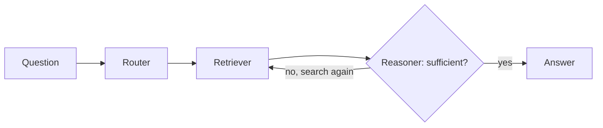

# mini-rag-eval

A minimal RAG pipeline over a single research paper, built so every step of retrieval is
visible — similarity search is a numpy dot product rather than a call into a vector
database. On top of it sits a hand-labelled evaluation set and a recall@k / MRR harness,
used to test two things most RAG tutorials recommend without measuring:

1. **Query rewriting** — expand the question into technical variants before retrieving.
2. **Routing** — send precise questions straight to retrieval and vague ones through
   rewriting, to get the benefits of both.

Neither beat plain retrieval. The routing heuristic did worse than doing nothing.

---

## Results

Ten labelled questions over a 67-chunk corpus, k = 10.

| Configuration | recall@10 | MRR |
|---|---|---|
| **Direct retrieval (baseline)** | **0.70** | **0.343** |
| Query rewriting | 0.60 | 0.135 |
| Routed hybrid | 0.60 | 0.262 |
| *Oracle router (best strategy per question)* | *0.90* | *0.416* |

The oracle row is the interesting one. It is not a system — it is what a router would score
if it always picked the better of the two strategies. The gap between it and the routed
hybrid, **0.90 against 0.60**, is the entire finding: the two strategies are strongly
complementary, and the heuristic that was supposed to exploit that captured none of it and
finished below the baseline it was meant to improve.

---

## Why the strategies are complementary

Only one question in ten fails under both strategies. Every other question is answered by at
least one of them.

| | Direct | Rewriting |
|---|---|---|
| What is EI? | ✅ rank 1 | ❌ |
| What are the compression results for ResNet-18? | ✅ rank 4 | ❌ |
| How is over-fitting avoided on the validation set? | ✅ rank 2 | ❌ |
| How does PARS improve the performance? | ❌ | ✅ rank 3 |
| Top-1 and top-5 accuracies of VGG-16 with BN? | ❌ | ✅ rank 3 |
| What is the compression ratio constraint for VGG-16? | ❌ | ❌ |

Three questions are solved only by direct retrieval, two only by rewriting, four by both,
one by neither. There is real signal here for a router to exploit — the problem is telling
which question is which.

## Why the router fails

The router classifies questions by surface features: digits, model names, question words.
Three of its four failures are misroutes, and each traces to a specific rule.

| Question | Routed to | Result | Other strategy | Cause |
|---|---|---|---|---|
| What is EI? | rewriting | ❌ | direct: **rank 1** | `"what is"` is in the conceptual keyword list |
| How is over-fitting avoided? | rewriting | ❌ | direct: **rank 2** | matched no rule; fell through to the conceptual default |
| Top-1/top-5 of VGG-16? | direct | ❌ | rewriting: **rank 3** | contains digits, so classified as a precise lookup |

"What is EI?" is a two-word acronym lookup — the most precise question in the set — and the
router sent it to rewriting because it starts with "what is". The VGG-16 accuracy question
contains numbers and was sent to direct retrieval on that basis, but the numbers are in the
*answer*, not the question. The underlying assumption — that question phrasing predicts which
retrieval strategy will win — does not hold on this corpus.

## Why rewriting demotes correct results

Rewriting generates three variants of the question, retrieves for each, merges the results
and re-sorts by score. Two questions show the mechanism cleanly:

| Question | Direct | Rewritten |
|---|---|---|
| Evaluation results of AlexNet using PARS? | rank 1, score 0.793 | rank 9, **score 0.793** |
| Rank search process at 3.5 FLOP compression? | rank 3, score 0.827 | rank 6, **score 0.827** |

**The score of the correct chunk is unchanged.** Its similarity to the query did not get
worse — rewriting pulled in additional chunks that scored higher and pushed it down the
merged list. Where the correct chunk was already ranked first, there is no headroom to gain
and only positions to lose. This is why rewriting costs more MRR (0.343 → 0.135) than
recall (0.70 → 0.60): it is primarily a ranking problem, not a finding problem.

## Rewriting is also not reproducible

`rewrite_query` calls the LLM at temperature 0.3 with no seed, so each run produces different
variants and a different merged pool. Across two runs of the same eval set, individual
questions moved between "retrieved at rank 4" and "not retrieved at all", swinging recall by
roughly 0.10 — the same magnitude as the effect being measured. Direct retrieval is
deterministic and does not move.

For an eval set this small, that variance is not a footnote. Any future comparison involving
rewriting needs a fixed seed or temperature 0 before the numbers mean anything.

---

## What is here

- Retrieval implemented transparently: cosine similarity as an explicit dot product over
  L2-normalised embeddings, so the mechanism is inspectable rather than delegated.
- `eval/eval_set.json` — ten questions, each mapped to the chunk indices that contain its
  answer. Labels were located by substring search and then verified by reading the full
  chunk text.
- recall@k and MRR implemented from scratch. recall@k asks whether a correct chunk was
  retrieved at all — it caps end-to-end quality, since generation cannot recover from a
  retrieval miss. MRR asks whether it was ranked high, which is what matters once the
  context window is finite.
- A LangGraph agent (router → retriever → reasoner → answer) whose reasoner returns a
  structured verdict and can loop back for a second retrieval, capped at 3 loops.
- Grounding controls: answer-only-from-context instruction, a forced
  `"Not found in document."` fallback, and low generation temperature.

### The agent



On a two-part question — *"What datasets were used to evaluate PARS and what were the final
accuracy results on each?"* — the first retrieval is judged insufficient, the reasoner
reformulates to *"What datasets were evaluated with PARS?"*, retrieves five more chunks and
answers from ten chunks across two loops.

---

## A note on the eval set

Ten questions over one paper is small. Each question is worth 0.1 recall, so differences
below roughly 0.2 should not be read as meaningful, and the conclusions above are findings
about this corpus rather than general claims about query rewriting.

The labels were audited after the first set of results, which turned up two problems worth
recording:

- One label was **wrong**. "What are the compression results for ResNet-18?" pointed at the
  rank-search convergence section rather than the results table, so that question had been
  scored against the wrong ground truth.
- One question had **no valid answer**. It asked for a result at a 3.5 FLOP compression
  ratio; the paper reports 3.03 and 3.22. A question with no ground truth measures nothing,
  so it was reworded to match what the paper actually discusses.

Several labels were also incomplete — with a 40-word chunk overlap, an answer near a
boundary genuinely appears in two chunks, and labelling only one scores a correct retrieval
as a miss.

Chunk 31 is labelled for two unrelated questions, because fixed-size splitting merged the end
of the hyperparameter section with the start of Section 6.1.1. That is visible evidence for
the next change below.

---

## Stack

Python · numpy · pypdf · sentence-transformers (`BAAI/bge-small-en-v1.5`) · Ollama
(`llama3.1:8b`) · LangGraph

No vector database, no API keys, no hosted inference — everything runs locally. At 67 chunks,
exact search is a single matrix multiply; FAISS would add a dependency without changing a
result. Past roughly 100k chunks this needs a real index (`IndexFlatIP`, then an approximate
index).

## Running it

```bash
pip install -r requirements.txt
ollama pull llama3.1:8b
jupyter lab notebooks/mini_rag.ipynb
```

The notebook runs top to bottom with all outputs saved, so the results above are visible
without executing anything. `src/mini_rag.py` is a stripped-down CLI version of the retrieval
pipeline — same chunking, embedding and retrieval, without the rewriting, routing or
evaluation layers.

**Corpus.** Sobolev, K.; Ermilov, D.; Phan, A.-H.; Cichocki, A. *PARS: Proxy-Based Automatic
Rank Selection for Neural Network Compression via Low-Rank Weight Approximation.* Mathematics
2022, 10, 3801. https://doi.org/10.3390/math10203801 — open access, CC BY 4.0. The PDF is not
committed; place it in `data/` and point `PDF_PATH` at it.

---

## Next

**Structure-aware chunking.** Splitting on a fixed word count ignores document structure, so
chunks straddle section boundaries and mix unrelated content — the chunk holding the
over-fitting answer also contains the start of a different section. Splitting on real
structure (`pymupdf4llm` to markdown, section metadata preserved) is the highest-value change,
and the eval harness above already exists to measure whether it helps.

**A learned router.** The keyword heuristic fails because surface features do not predict
strategy. An LLM classifier, or a router trained on the eval set itself, has a defined target
to beat: 0.60 recall from the current router, against a 0.90 ceiling.

**Multi-document corpus.** Extending to 4–5 papers tests whether the findings above survive a larger, more heterogeneous corpus, and introduces cross-paper retrieval — where a question may be answerable from more than one source, and provenance starts to matter.

## Limitations

- Ten questions, one paper, single annotator, no inter-annotator agreement.
- Evaluation covers retrieval only. Answer faithfulness and relevance — typically
  LLM-as-judge — are not measured, so a correct retrieval followed by a wrong answer is
  invisible here.
- Query rewriting is unseeded, so its numbers carry run-to-run variance of roughly 0.10 recall.
- Single document; no cross-paper retrieval or citation resolution.
